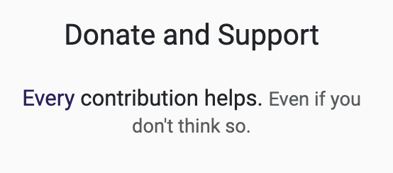
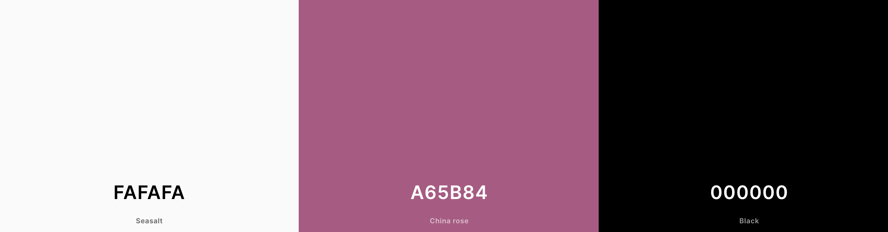
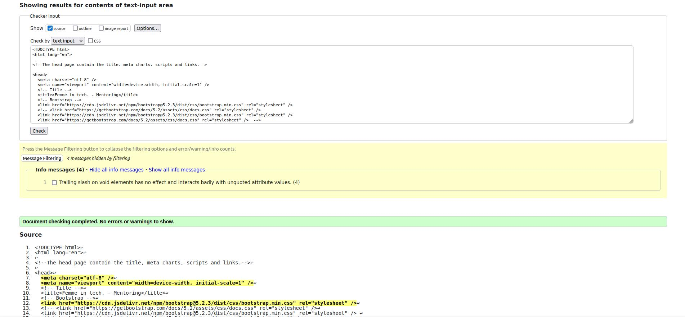
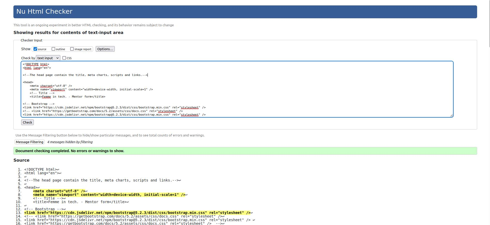
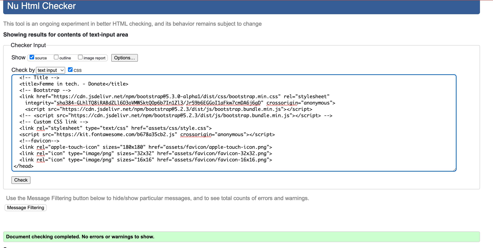
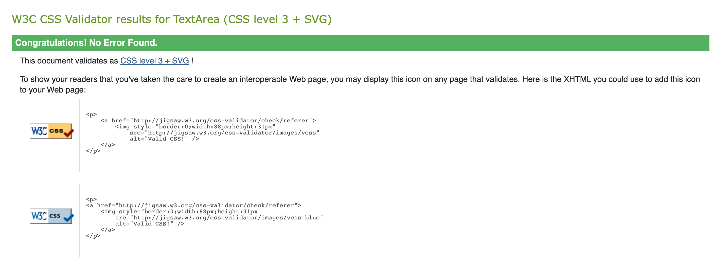
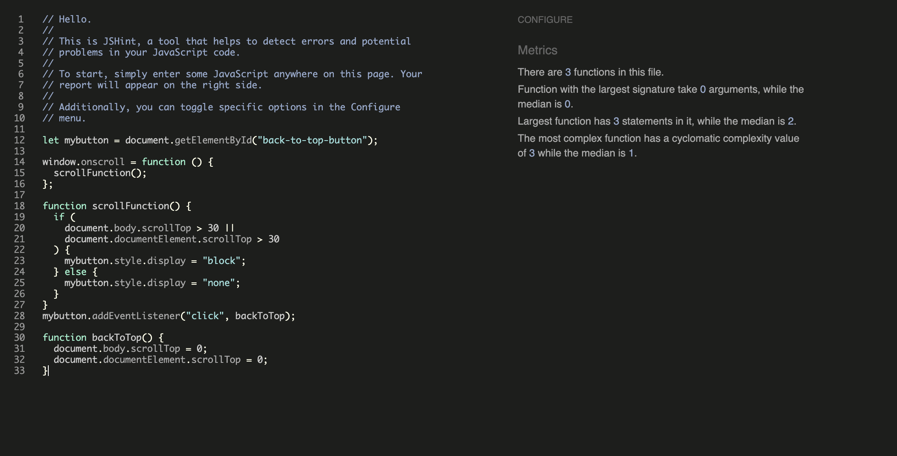

# Femme in tech..

A project by: 
[Chris](https://github.com/Christoph33one)
[Hannah](https://github.com/Hanmb17)
[KP](https://github.com/ARcKP98)
[Otto](https://github.com/Oxyotl)
[Sofia](https://github.com/Sofia-Bourdon)
[Razvan](https://github.com/bubtroniq)
[Vasi](https://github.com/Vasi012) 

# Project goal
The term "women/femme in tech" describes the presence and involvement of women in the technology industry. 

Celebrating women in tech involves acknowledging their achievements and contributions to the field, as well as supporting initiatives that encourage more women to pursue careers in technology. 

This promotes the development of the next generation of female tech leaders and fosters a more diverse and inclusive industry.

---

### The live website can be found [here](https://christoph33one.github.io/Womens-day-Hackathon-2023/index.html)

# List of contents
<li><a href="#project-goal">Project goal</a></li>
<li><a href="#target-audience">Target Audience</a></li>
<li><a href="#home-page">Landing page</a></li>
<li><a href="#about-us">About us</a></li>
<li><a href="#history">History</a></li>
<li><a href="#contact-us">Contact us</a></li>
<li><a href="#mentoring">Mentors</a></li>
<li><a href="#donating">Donating</a></li>
<li><a href="#typography">Typography & Color Scheme</a></li>
<li><a href="#wire-frames">Wireframes</a></li>
<li><a href="#features">Features</a></li>
<li><a href="#testing">Testing</a></li>

# Target Audience 
The target audience for Femme Tech is women who are interested in or currently pursuing careers in technology. This includes students studying computer science, engineering, and related fields, as well as professionals working in various roles within the tech industry. Our website is also relevant to women who are considering a career change or exploring opportunities in tech. In addition to women in the tech industry, we also aim to reach individuals who are passionate about promoting diversity and inclusion in the workplace. We welcome all genders, ages, and backgrounds to join our community, support our mission and view our website.

---

---

# Home page

With the use of a striking image, we aim to give users a clear understanding of the main objective of our website - empowering women in tech. Our homepage comprises of two main sections.

The first section features a visually captivating image that showcases our mission and values at Famme Tech. Along with the image, we provide a concise yet compelling description of our goals and aspirations.

In the second section, we give our users a glimpse into the inspiring stories of women who are making a significant impact in the tech industry. Through their reviews, you'll gain insight into the challenges they have faced and how they have overcome them, as well as the positive impact they have made on their colleagues, clients, and communities. These women are trailblazers, and their stories are a testament to the importance of diversity and inclusion in the tech sector.

--- 

# About Us
- About Us: At Femme Tech, our mission is to empower women in technology. Our "About Us" section provides a comprehensive overview of our organization, including our goals, values, and the services we provide to our community.

- Mentoring Program: Our mentoring program is a cornerstone of our organization, connecting aspiring female tech professionals with experienced mentors who provide guidance and support throughout their career journey. Our mentors are passionate about empowering women in tech and helping them achieve their goals.

- Community: At Femme Tech, we believe in the power of community. We're proud to have a supportive network of like-minded individuals who share our commitment to creating a more inclusive and diverse industry. Our community is a place where women in tech can learn, connect, and grow together.

- Inspiring Women in Technology: We believe that inspiring women to pursue careers in technology is crucial for creating a more diverse and inclusive industry. Our website explains why this is so important, highlighting the positive impact that women can have on the industry and the benefits of greater diversity.

- Supporting Other Initiatives: We're committed to supporting other initiatives that promote opportunities for women in tech and empower them to achieve their goals. We partner with non-profit organizations across the world to help make a difference in the lives of women in tech and to create a brighter future for all.

NEEDS AN IMAGE HERE!!!!

--- 

# History
At Femme Tech, we believe in celebrating the achievements of women in tech, both past and present. History may seem boring, but the stories of superwomen like Ada Lovelace and Annie Easley are anything but. Lovelace was the world's first computer programmer, while Easley was a groundbreaker for gender and racial diversity in the field. Our page is dedicated to educating and inspiring our users with the amazing contributions of women in tech, and reminding them of the endless possibilities for their own future in the industry.

---

# Contact Us
At Femme Tech, we want to make it easy for users to get in touch with us. That's why we've created a simple and user-friendly contact form. To ensure that we can respond to your inquiry or feedback in a timely manner, we do require that the name and email fields be filled out before submitting the form. This is a standard form validation process that helps us avoid spam and ensures that we can get back to you as quickly as possible. We look forward to hearing from you!

--- 

# Mentoring
At Femme Tech, our mentoring program is a cornerstone of our mission. We understand the importance of structure and personalized attention in supporting women as they navigate the tech industry. That's why we've created a robust and validated form that allows potential mentors to share their expertise and experience with our community. Whether you're a seasoned professional or just starting out in your career, our mentoring program provides a valuable opportunity to help teach and support women in tech. We welcome anyone who is passionate about empowering women and promoting diversity and inclusion in the industry to join us in this effort.

### Become a mentor
Our mentoring program features a comprehensive form with form validation, designed to gather important personal information and skill sets from potential mentors. We understand the value of matching mentees with the right mentors, and our detailed form helps us achieve this goal. We encourage individuals who are passionate about supporting women in tech to sign up as mentors and join our community.

### Become a mentee
The mentee program is another alternative. Not all people ahve a big skills set, but could still be a very valuable mentee and have the right passion and motivation. This form is of similar structure as to the mentor form. User will need to added personal details but some skills, although skills are not required. 

Our mentee program offers an alternative option for individuals who may not have an extensive skill set, but possess the passion and motivation to succeed in the tech industry. Our mentee form follows a similar structure to our mentor form, requiring personal details but not necessarily specific skills. We believe that everyone deserves the opportunity to learn and grow, and our mentee program is designed to help women in tech do just that.

--- 

# Donating
Our modern world isn't so modern for some. We aimed to broaden the user's understanding of how vital it is to extend beyond our own communities and consider the needs of women in other areas. In today's world, numerous challenges persist, which may not seem as contemporary to some. Thus, we incorporated a donations section, where users can learn about two non-profit organizations that offer significant assistance to women living in underprivileged communities. These organizations operate in regions where corruption, war, disease, and governmental control have hindered women from receiving adequate education or pursuing a better life and career. 

Click on any of two links and the user will be directed to a donations website.

# Typography & Color Scheme

Typography 
The fonts used were Roboto and Sans serif

Color Scheme 

---

###	404 page 

The website has been implemented with type of error in order to allow users to be able to understand when they navigate to a broken link. 

On the 404 page a home button has been implemented in order to allow users to be able to return home without using the back arrow button.

##	Features

A favicon has been implemented with women coding to symbolize the meaning of the page and at the same time to allow users to easily identify this website if they have multiple tabs open.

At the same time, the title has been selected to offer a clear description of the page where the user is navigating, such as Home, About, History, Contact Us, Mentoring and Donate page.

# Wireframes

The wireframes have been created in order to allow the members of the team to have an overview of what the website will look like or a simple vision to guide us to completion of the website.

However, the website frameworks have not really been followed as we decided to implement a more simplicity for the pages so that users will find it more easily to familiarise with the webpage.

### Home page

### About Us page:

---

### History page:

---

### Mentoring page

---

### Donate page & Mobile view:

---

## Technologies.

1. HTML -> The structure of the website was developed using HTML.
2. CSS -> The website has been styled using custom CSS in a n external file style.css.
3. Bootstrap -> Has been used to compile and style faster the website due to the short deadline.
4. JavaScript -> tbc
5. GitHub -> Source of code is hosted on Github and deployed using GitPod / Git pages.
6. Font Awesome -> Icons obtained from font awesome used withing the body element.
7. Favicon.io -> Favicon files were created at favicon files.
8. Balsamiq -> Was used to create wireframes.
9. Photoshop -> used to create the main image and other present images.
10. Photopea -> used to create the logo of the website.
11. Photopea -> Used to create the favicon presented on the website. 
12. Google Image -> Has been used for some images presented on the website.

## Deployment
1.	The site was deployed to pages. The steps to deploy are as following:
2.	In the GitHub repository, navigate to the Settings tab.
3.	From the menu on left select 'Pages'.
4.	From the source section drop-down menu, select the Branch: main.
5.	Click 'Save'.
6.	A live link will be displayed in a green banner when published successfully.
7.	The live link can be found [here]TBC.

## Clone the repository code locally

Navigate to the GitHub Repository you want to clone to use locally:
1.	Click on the code drop down button.
2.	Click on HTTPS.
3.	Copy the repository link to the clipboard.
4.	Open your IDE of choice. (git must be installed for the next steps)
5.	Type git clone copied-git-url into the IDE terminal. The project will now be cloned on your local machine for use.

---

# Testing

### Validation checks

All pages underwent validation checks to ensure that every line of code was scrutinized for syntax errors, including missing delimiters or other necessary parameters. Syntax errors such as open tags, misspellings, and forgotten quotation marks, colons, or equal signs may still render a web page, but the resulting output may differ from the designer's original intent due to malfunctioning tags or elements.

In essence, an HTML validator verifies whether a web page's HTML and CSS codes adhere to the standards established by the World Wide Web Consortium (W3C). 

HTML 
Index.html - passed all checks

Mentoring.html - passed all checks

Mentee-form.html - passed all checks

Mentor-form.html - passed all checks

Donate.html - passed all checks

CSS 

JS
script.js validation 

CREDITS TO BE ADDED!!!

# Thank you. 
